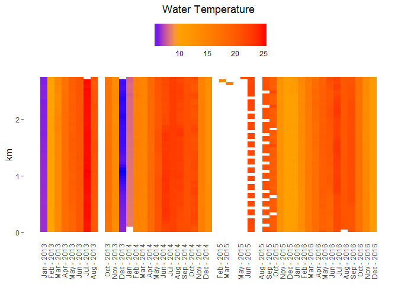
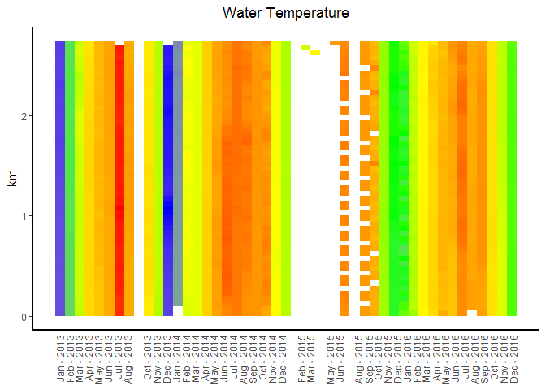

<!-- README.md is generated from README.Rmd. Please edit that file -->
Installation
------------

``` r
library(devtools)
install_github("ucd-cws/wq-heatplot")
```

Basic Use
---------

### Load Data

Export all the water quality data from a given slough using the [arcproject-wq-processing toolbox](https://github.com/ucd-cws/arcproject-wq-processing) `Export Heatplot data CSV`

``` r
# load data from the csv
data <- read.csv("tests/example_data.csv", stringsAsFactors = FALSE)

# view first 5 rows
head(data, 5)
#>    id site_id           date_time  y_coord x_coord spatial_reference_code
#> 1 783       2 2013-01-07 10:05:45 565958.6 2019673                  26942
#> 2 784       2 2013-01-07 10:05:50 565961.5 2019668                  26942
#> 3 785       2 2013-01-07 10:07:55 565989.1 2019650                  26942
#> 4 786       2 2013-01-07 10:08:00 565987.9 2019652                  26942
#> 5 787       2 2013-01-07 10:08:05 565986.5 2019654                  26942
#>    m_value            source temp   ph sp_cond salinity dissolved_oxygen
#> 1 11.63801 Arc_010713_wqt_ln 6.48 7.32     335     0.16              6.9
#> 2 15.47803 Arc_010713_wqt_ln 6.47 7.32     335     0.16              6.9
#> 3 46.35845 Arc_010713_wqt_bk 6.46 7.32     350     0.17              6.9
#> 4 44.85101 Arc_010713_wqt_bk 6.46 7.33     354     0.17              6.9
#> 5 43.13106 Arc_010713_wqt_bk 6.46 7.34     356     0.18              6.9
#>   dissolved_oxygen_percent dep_25 par rpar turbidity_sc  chl chl_volts
#> 1                     67.2   0.50 324  161         72.9   NA        NA
#> 2                     67.2   0.55 310  150         72.9 4.56        NA
#> 3                     67.2   0.55 248  128         71.3 4.68        NA
#> 4                     67.2   0.54 255  134         71.3 4.68        NA
#> 5                     67.2   0.48 254  133         71.3 4.68        NA
#>   chl_corrected notes
#> 1            NA      
#> 2      3.456016      
#> 3      3.565398      
#> 4      3.565398      
#> 5      3.565398
```

### Default Heatplot

``` r
library(arc.heatplot)

p <- heatplot(data, dateField = "date_time", distanceField = "m_value", wqVariable = "temp", title="Water Temperature")

plot(p)
```


### Change Color Ramp

``` r

p2 <- p + change_gradient_breaks(c("blue", "orange", "red"), c(0, 5, 25)) # uses 3 colors with breaks at 0, 5 & 25

plot(p2)
```



### Modify plot appearance

``` r

# modify the plot object using standard ggplot2 operations

# remove legend
p3 <- p + guides(fill=FALSE) # no legend

# add lines for the xy axis
p4 <- p3 + theme(axis.line = element_line(color="black", size = 1))

p4
```


