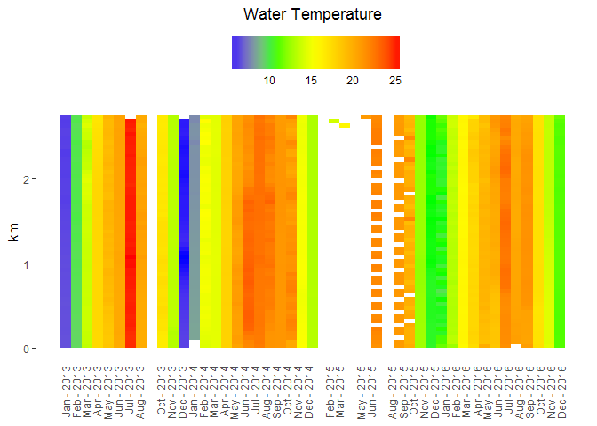
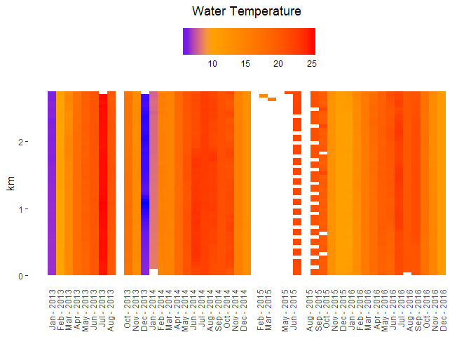
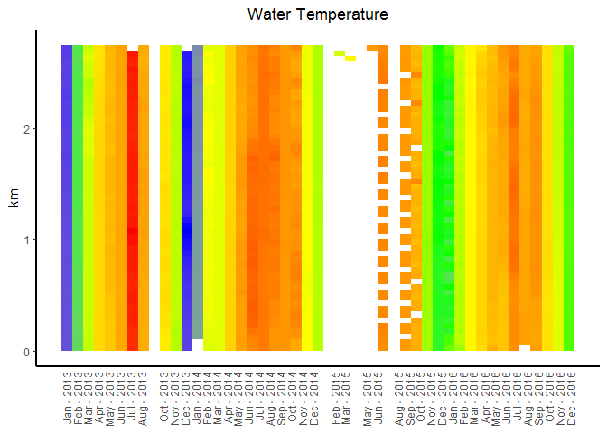
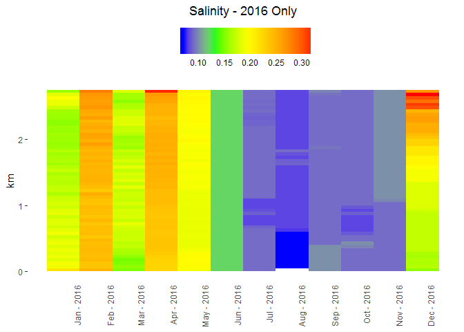
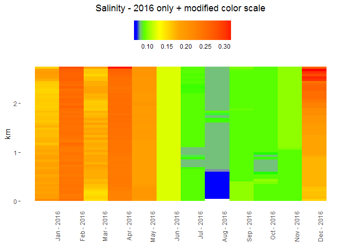

<!-- README.md is generated from README.Rmd. Please edit that file -->
wq.heatplot
===========

R package for creating Heatplots for the Arcproject's water quality data.

Installation
------------

``` r

# Install ggplot2, scales, and devtools

if(!require(ggplot2)){
  install.packages("ggplot2")
  library(ggplot2)
}

if(!require(scales)){
  install.packages("scales")
  library(scales)
}

if(!require(devtools)){
  install.packages("devtools")
  library(devtools)
}

# install package from github
install_github("ucd-cws/wq-heatplot")
```

Basic Use
---------

### Load Data

Export all the water quality data from a given slough using the [arcproject-wq-processing toolbox](https://github.com/ucd-cws/arcproject-wq-processing) `Export Heatplot data CSV` tool.

#### Data from a csv file

``` r
# load data from the csv
data <- read.csv("tests/example_data.csv", stringsAsFactors = FALSE)
```

#### Data from the arcproject database with RSQLite

``` r
library(RSQLite)

# path to the database (assuming arcproject-wq-processing is installed)
db_name <- Sys.getenv("arcproject_db_path")  # get the DB location

# alternatively hard code the path to the database
#db_name <- "path/to/folder/with/database"

# connect to the sqlite database
con = dbConnect(SQLite(), dbname=db_name)

# select site id number for the reach
site_id = 1

# select all water quality data for a specific
statement = paste("select * from water_quality where site_id =", siteid, "and m_value IS NOT NULL")

# water quality at selected site as dataframe
data = dbGetQuery(con, statement) 

# finally disconnect from the database
dbDisconnect(con)
```

### Default Heatplot

``` r
library(wq.heatplot)

p <- heatplot(data, dateField = "date_time", distanceField = "m_value", 
              wqVariable = "temp", title="Water Temperature")

plot(p)
```



### Change Color Ramp

``` r

p2 <- p + change_gradient_breaks(c("blue", "orange", "red"),
                                 c(0, 5, 25)) # uses 3 colors with breaks at 0, 5 & 25

plot(p2)
```



### Modify plot appearance

``` r

# modify the plot object using standard ggplot2 operations

# remove legend
p3 <- p + guides(fill=FALSE) # no legend

# add lines for the xy axis
p4 <- p3 + theme(axis.line = element_line(color="black", size = 1))

p4
```



### Full Example - custom color scale for salinity for 2016

``` r

# subset data to only include dates in 2016
data_sub_2016 <- subset(data, date_time > "2016-01-01" & date_time < "2017-01-01")

# generate basic heatplot for salinity
p <- heatplot(data_sub_2016, dateField = "date_time", 
              distanceField = "m_value", wqVariable = "salinity", 
              title="Salinity - 2016 Only")

plot(p)
```



``` r

# find the min/max of salinity to use as the endpoints of the color ramp
min_sal <- min(data_sub_2016$salinity)
max_sal <- max(data_sub_2016$salinity)

print(paste("Range of Salinity:", min_sal, "-", max_sal))
#> [1] "Range of Salinity: 0.07 - 0.6"

# change the break values for the color ramp but keep the default colors
p2 <- p + change_gradient_breaks(mapped_break_values = c(min_sal, 0.1, 0.2, 0.3, max_sal)) + 
  ggtitle("Salinity - 2016 only + modified color scale")


plot(p2)
```


